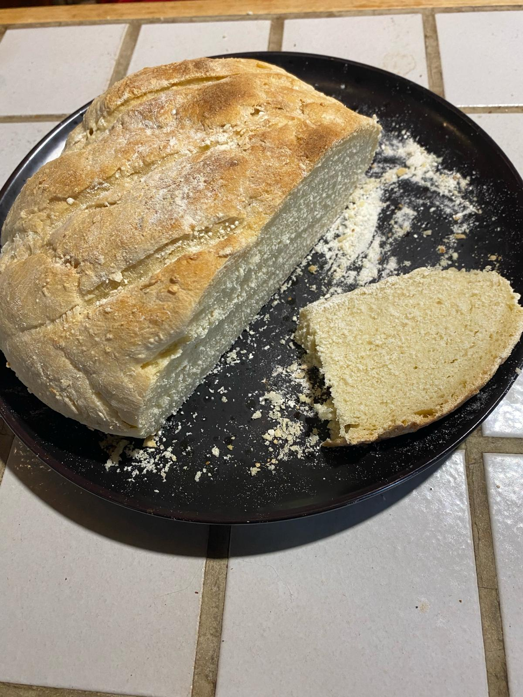
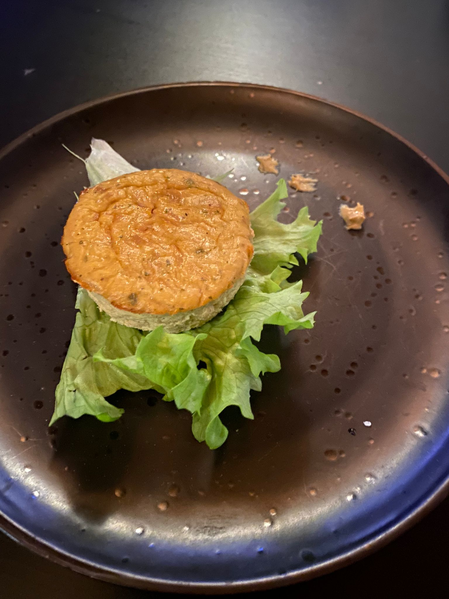

|  [About](./) | [Experiences](./work-exp.md) | [Education](./education.html) | [Publications](./scientific-publications.html) |  [Recipe](./Recipe.html)| 

## Cooking tips

**bread** 🌿

In a mixing bowl:

- flour: 500 g
- salt: 5 g
- fresh yeast: 25 g
- water: 300 ml - 25°C  

⚠️ Do not put yeast and salt directly in contact, or your yeast won't activate.  
 
Mix and knead to obtain a dough.  
Let it rest for 3 hours at ~25°C.  
After 3 hours, remove the dough and knead again, adding flour if needed.  
Shape into bread and place in the oven.  
 
My tip: In a small bowl, mix a small amount of nut oil, hot water, and salt. Brush the bread with this mixture before baking.

 

  

  

---

**cupcake tuna mustard**

In a bowl :
- tuna : 150 g
- eggs : 3
- salt, pepper
- mustard : 2cs
- cream cheese: 2 cs  

Mix the ingredients thoroughly, then pour the mixture into cupcake molds. Bake in the oven at approximately 180°C for around 30 minutes.

 

  

 

---

**blesoto mushroom, broccoli, feta**

Start by cooking the vegetables:

- Heat some oil in a pan.
- Sauté chopped onions, shallots, and garlic until golden brown. Season with salt and pepper to taste.
Meanwhile, briefly boil the broccoli for 1 minute.

Once the onions are caramelized, add the mushrooms to the pan. Once the mushrooms are cooked, transfer them to a casserole dish and set aside.

In the same pan, cook the barley. Add water and vegetable bouillon cubes for flavor. Allow the barley to simmer until tender.

Once the barley is cooked, combine it with the cooked vegetables in the casserole dish. For added creaminess, crumble some feta cheese into the mixture and gently stir until well incorporated. Serve hot and enjoy!

 

  

 
  

---

**japanese curry** 🌿

Cut the following ingredients into small pieces and place them in a casserole:
- Carrots
- Potatoes
- Onions
- Garlic
- Leeks
- Mushrooms  

Add water and soy sauce to prevent sticking and let them cook. 
Start cooking your rice about 7 minutes before your vegetables are cooked.  
When the vegetables are cooked, turn off the heat for 2 minutes, then add Japanese golden curry. 🔥🔥  
Serve and enjoy

---

**vegetarian couscous** 🌿

Cut the following ingredients into small pieces and place them in a casserole:
- Carrots
- Potatoes
- Onions
- Garlic
- Other vegetables from your fridge
- Tomato sauce  

When the potatoes and carrots are almost cooked, add chickpeas and sliced seitan. 
Prepare your couscous. 
Serve and enjoy!

